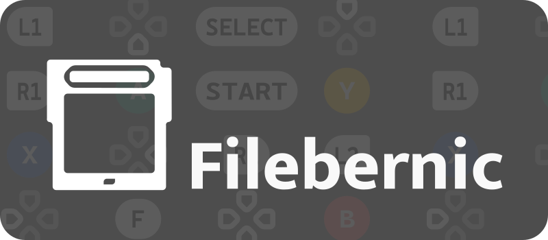

<p align="center">
  
</p>

#  FileBernic

**FileBernic** es un gestor de ROMs con una interfaz cuidada, diseñado específicamente para dispositivos portátiles con **muOS** (testado y usado en Anbernic RG35XX-H).

## Características

- **Diseño Nativo**: Interfaz fluida y minimalista integrada con la estética de muOS.
- **Doble SD**: Gestión completa entre `/mnt/mmc` (SD1) y `/mnt/sdcard` (SD2).
- **Scraper Multifuente**: Descarga carátulas, capturas y descripciones usando TheGamesDB, ScreenScraper y Libretro.
- **Gestión de Partidas**: Copia y mueve tus _Save Games_ entre tarjetas SD fácilmente.
- **Mantenimiento**: Herramientas integradas para limpiar archivos huérfanos e imágenes innecesarias.
- **Vistas Flexibles**: Elige entre modo **Lista** o modo **Grid**.
- **Modo "Juego Único"**: Combina versiones de distintas regiones en una sola entrada para una biblioteca más limpia.

## Instalación en muOS

1. Ve a la sección de [Releases](https://github.com/nef734/filebernic/releases) y descarga el archivo `filebernic.muxapp` más reciente.
2. Conecta tu tarjeta SD al PC o usa el explorador de archivos de muOS.
3. Copia el archivo `filebernic.muxapp` en la carpeta `MUOS/application/` de tu tarjeta SD principal.
4. En tu dispositivo, abre el menú de **Applications** y selecciona **FileBernic**.

## Configuración del Scraper

Para aprovechar al máximo el Scraper de **TheGamesDB**, se recomienda introducir tu propia API Key:

1. Pulsa **Start** para abrir la configuración.
2. Ve a **Ajustes API**.
3. Selecciona **TheGamesDB API Key** e introduce tu clave.
4. _Opcional_: También puedes configurar tus credenciales de **ScreenScraper**.

### Configuración Manual (Alternativa)

Si el teclado virtual no aparece o prefieres editar los archivos directamente, puedes configurar tus claves manualmente:

1. Localiza el archivo `filebernic/data/config.json` en tu tarjeta SD.
2. Ábrelo con un editor de texto en tu PC.
3. Introduce tus credenciales en los campos correspondientes. El archivo debe verse algo así:

```json
{
  "thegamesdb_apikey": "TU_API_KEY_AQUI",
  "screenscraper_user": "TU_USUARIO",
  "screenscraper_password": "TU_PASSWORD",
  "scraperApi": "all"
}
```

4. Guarda el archivo y reinicia **FileBernic**.

## Controles

- **A**: Aceptar / Entrar en Carpeta / Lanzar Juego.
- **B**: Atrás / Subir de nivel.
- **Y**: Menú de Opciones (Scraper, Copiar, Mover, Borrar, Favoritos).
- **X**: Selección múltiple (para borrar o scrapear en lote).
- **L1**: Buscador rápido.
- **R1**: Ayuda en pantalla (menú contextual).
- **Start**: Menú de Configuración (Vista, Modo, Re-indexar, Limpieza).
- **Select**: Salir de la aplicación.

## Contribuciones

¿Has encontrado un error o tienes una idea genial?

- Abre una [Issue](https://github.com/nefDevelop/filebernic/issues) explicando el problema.


## Licencia

Este proyecto está bajo la **Licencia MIT**. Siéntete libre de usarlo, modificarlo y compartirlo. Consulta el archivo `LICENSE` para más detalles.

---

Desarrollado con ❤️ para la comunidad de muOS.
